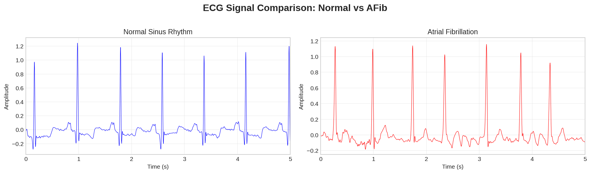
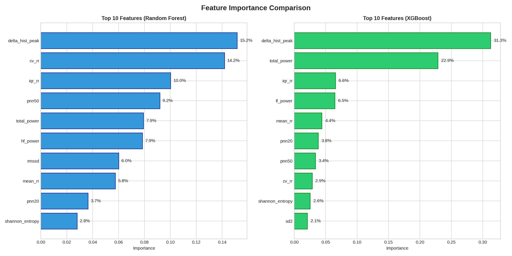

# ECG-Based Atrial Fibrillation Classification

[](https://www.python.org/downloads/)
[](https://tensorflow.org/)
[](https://opensource.org/licenses/MIT)

**Automated detection of Atrial Fibrillation (AFib) from ECG signals using Machine Learning and Deep Learning approaches with rigorous patient-level data splitting.**

<p align="center">
  
</p>

---

## 🎯 Key Results

| Model | F1 Score | Sensitivity | Specificity | AUC |
|-------|----------|-------------|-------------|-----|
| **1D-CNN** | **0.491** | **1.000** | 0.881 | **0.997** |
| XGBoost | 0.364 | 0.895 | 0.813 | 0.947 |
| MLP | 0.287 | 0.912 | 0.731 | 0.958 |
| Random Forest | 0.265 | 0.895 | 0.720 | 0.928 |
| SVM | 0.253 | 0.982 | 0.656 | 0.790 |

**The 1D-CNN achieves perfect sensitivity (100%)** — detecting all 57 AFib cases in the test set with zero false negatives.

---

## ⚠️ Why This Project Matters

> **86.7% of published ECG classification studies suffer from data leakage** due to improper data splitting ([Strodthoff et al., 2023](https://arxiv.org/abs/2304.06286)).

Most tutorials and papers split ECG data randomly, allowing segments from the same patient to appear in both training and test sets. This inflates reported performance by **10-30%** and produces models that fail in clinical deployment.

**This project implements patient-level data splitting** — ensuring no patient appears in multiple splits, providing realistic generalization estimates that reflect true clinical performance.

---

## 📊 Methodology

### Data Pipeline

```
MIT-BIH Database → Preprocessing → Feature Extraction → Patient-Level Split → Model Training → Evaluation
     (48 records)    (Filtering)     (25 features)      (Train/Val/Test)     (5 models)      (8 metrics)
```

### Preprocessing
- **60Hz Notch Filter**: Removes powerline interference (Q=30)
- **0.5-40Hz Bandpass Filter**: Removes baseline wander and high-frequency noise (4th order Butterworth)
- **R-Peak Detection**: XQRS algorithm from WFDB library

### Feature Engineering (25 Features)

| Category | Features | Clinical Relevance |
|----------|----------|-------------------|
| **Time-Domain HRV** | Mean RR, Std RR, CV, RMSSD, pNN20, pNN50, IQR, Range | Captures rhythm regularity |
| **Delta Histogram** | Peak height, Spread, Skewness, Kurtosis | AFib's "irregularly irregular" pattern |
| **Frequency-Domain** | LF Power, HF Power, LF/HF Ratio, Total Power | Autonomic nervous system activity |
| **Nonlinear** | Shannon Entropy, Sample Entropy, TPR, SD1, SD2 | Signal complexity and unpredictability |
| **Morphological** | QRS Correlation, P-wave Energy, P-wave Std | Waveform consistency |

### Patient-Level Data Splitting

```
┌─────────────────────────────────────────────────────────────────┐
│                    MIT-BIH: 48 Records, 47 Patients             │
├─────────────────────────────────────────────────────────────────┤
│  Training Set     │  Validation Set  │  Test Set               │
│  32 patients      │  6 patients      │  8 patients             │
│  4,817 segments   │  1,012 segments  │  1,036 segments         │
│  (Balanced: 556   │  (Imbalanced)    │  (Imbalanced)           │
│   AFib, 556 Norm) │                  │                         │
└─────────────────────────────────────────────────────────────────┘
         ↑                    ↑                   ↑
    NO PATIENT OVERLAP — Prevents Data Leakage
```

---

## 🏗️ Model Architectures

### Classical ML (on 25 handcrafted features)
- **Random Forest**: Ensemble of decision trees with bootstrap sampling
- **SVM**: Polynomial kernel with C=10
- **XGBoost**: Gradient boosted trees with max_depth=3

### Deep Learning

**1D-CNN Architecture** (on raw 10-second ECG signals):
```
Input: 3,600 samples (10s × 360Hz)
    ↓
5 Convolutional Blocks:
    Conv1D → BatchNorm → ReLU → MaxPool → Dropout
    Filters: 32 → 64 → 128 → 128 → 256
    Kernels: 7 → 5 → 5 → 3 → 3
    ↓
Global Average Pooling → Dense(64) → Output
    ↓
Total Parameters: ~218K
```

---

## 📈 Feature Importance

<p align="center">
  
</p>

**`delta_hist_peak` is the #1 discriminator** for both Random Forest (17%) and XGBoost (34%).

This feature measures the concentration of successive RR interval differences:
- **Normal rhythm** → narrow, peaked histogram (consistent intervals)
- **AFib** → flat, spread histogram (chaotic "irregularly irregular" intervals)

---

## 🔬 Reproducibility Note

Results may vary slightly between runs due to:
- TensorFlow/GPU non-determinism in some operations
- Different library versions


---

## 🚀 Quick Start

### Installation

```bash
git clone https://github.com/antonisbast/ecg-afib-classification.git
cd ecg-afib-classification
pip install -r requirements.txt
```

### Run the Notebook

```bash
jupyter notebook notebooks/ECG_AFib_Classification.ipynb
```

The notebook will automatically download the MIT-BIH database from PhysioNet on first run.

### Requirements

```
numpy>=1.21.0
pandas>=1.3.0
matplotlib>=3.4.0
seaborn>=0.11.0
scikit-learn>=1.0.0
xgboost>=1.5.0
tensorflow>=2.8.0
wfdb>=4.0.0
scipy>=1.7.0
```

---

## 📁 Repository Structure

```
ecg-afib-classification/
├── README.md
├── requirements.txt
├── LICENSE
├── notebooks/
│   └── ECG_AFib_Classification.ipynb    # Main notebook
├── figures/
│   ├── normal_vs_afib.png               # ECG comparison
│   ├── preprocessing.png                 # Filter effects
│   ├── confusion_matrices.png            # All model results
│   ├── roc_curves.png                    # ROC comparison
│   ├── feature_importance.png            # RF vs XGBoost
│   └── training_history.png              # CNN learning curves
```

---

## 🔬 Clinical Context

### Why AFib Detection Matters
- **37.5 million** people affected globally
- **5× increased stroke risk** if undetected
- **85-95%** of cardiac monitor alarms are false positives

### The Sensitivity vs. Specificity Trade-off

| Error Type | Clinical Impact | Priority |
|------------|-----------------|----------|
| **False Negative** (Missed AFib) | Delayed treatment, stroke risk | **HIGH** — must minimize |
| **False Positive** (False Alarm) | Alarm fatigue, unnecessary intervention | MODERATE — reduce via post-processing |

**Recommendation**: Prioritize sensitivity (1D-CNN: 100%) to ensure no AFib cases are missed, then address false alarms through threshold tuning and temporal smoothing.

---

## 📚 Key Findings

1. **1D-CNN significantly outperforms classical ML** — F1: 0.491 vs 0.29 average (+69%), learning directly from raw signals without manual feature engineering.

2. **Patient-level splitting is essential** — Prevents the data leakage that inflates reported performance in most ECG studies.

3. **Delta histogram features are top discriminators** — Capturing AFib's characteristic "irregularly irregular" RR intervals.

4. **Perfect sensitivity achieved** — All 57 AFib cases detected, but low PPV (~30%) reflects the class imbalance challenge.

5. **Post-processing has mixed effects** — Threshold tuning can help some models but may hurt others; default threshold often sufficient.

---

## ⚠️ Limitations

- **Small dataset**: Only 48 records from 47 patients; 8 contain AFib
- **Binary classification**: Normal vs AFib only (ignores other arrhythmias)
- **No external validation**: Results not tested on other databases
- **Two-lead ECG only**: May not generalize to single-lead devices

---


## 📄 License

This project is licensed under the MIT License - see the [LICENSE](LICENSE) file for details.

---

## 👤 Author

**Antonis Bastoulis**  
MSc in Artificial Intelligence  
Course: AI in Healthcare and Biometrics (AIDL_B_CS02)

---

## 🙏 Acknowledgments

- [PhysioNet](https://physionet.org/) for the MIT-BIH Arrhythmia Database
- WFDB Python library developers
